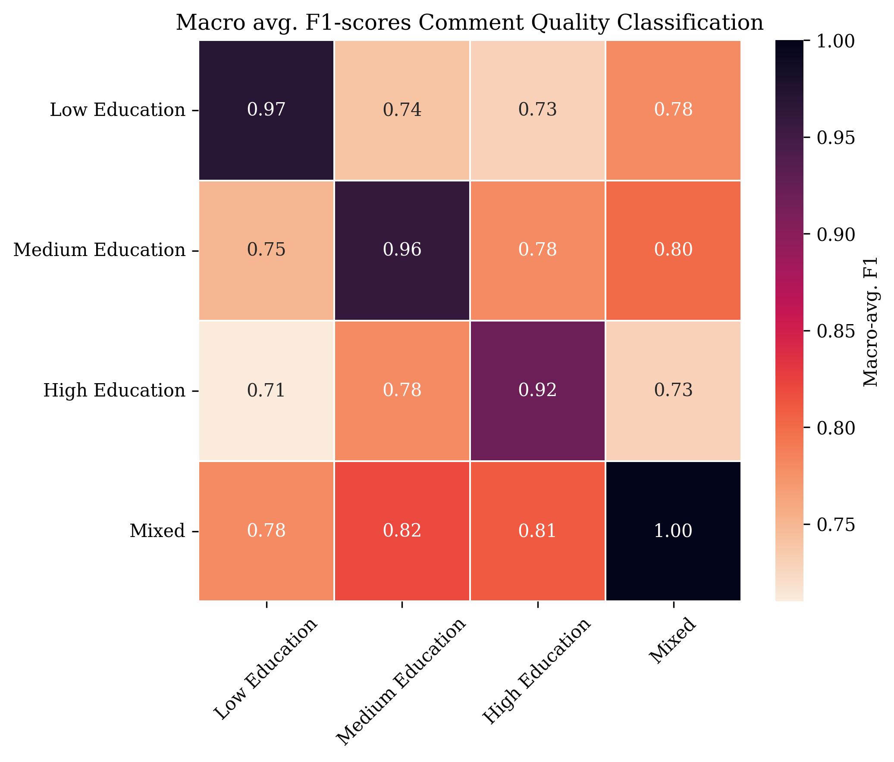
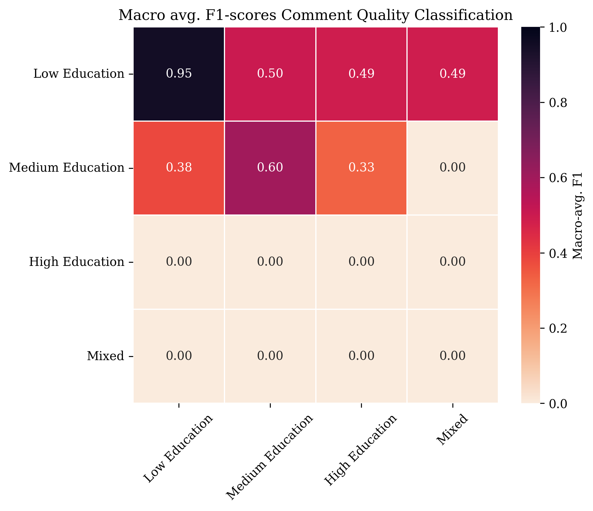

## Investigating annotator bias in comment quality and incivility classification by formal education

This repository contains the source-code to the study _"Investigating Annotator Bias in Comment Quality and Incivility Classification by Formal Education."_ Our research explores how annotators’ **formal education levels** influence the behavior of machine learning classifiers for **comment quality (deliberation)** and **incivility** in online discussions that are trained on their annotations.

Rather than treating disagreement as noise, the study highlights systematic differences in interpretation based on social background, advocating for more inclusive and representative modeling.

Please read and cite this paper, if you build on this work:

Wilms, L., Stoll, A., & Ziegele, M. (2025): _Investigating Annotator Bias in Comment Quality and Incivility Classification by Formal Education._

Enjoy 💞

---

## 🔬 Methods Overview

- **Dataset**: 13,677 German-language user comments from online debates.
- **Annotators**: Crowd workers grouped by **low**, **medium**, and **high formal education** levels.
- **Annotation Targets**:
  - **Deliberative quality** (e.g., constructive, knowledge-rich content)
  - **Incivility** (e.g., toxicity, vulgarity, personal attacks)
- **Approach**:
  - Trained separate classifiers on subsets of annotations grouped by education level.
  - Analyzed differences in model performance and in **linguistic features** predictive of class labels.

---

## 📊 Key Findings

- Classifiers trained on annotations from different education groups yielded **substantially different predictions**.
- **High- and medium-educated annotators** were more sensitive to nuanced indicators of deliberative quality and incivility.
- Specific language features (e.g., **solution proposals**, **accusations of lying**) were more strongly associated with annotations from the high-education group.
- The study emphasizes the importance of acknowledging and integrating **group-specific labeling tendencies** in model development to promote fairness and inclusivity.







---

## 🤓 You Might Want to Improve

- **Number of Annotator per Group**: We collected 3 annotations for each educational group and comment, while a higher number might provide higher measurement reliability.
- **Label Imbalance in Incivility Dataset**: The small number of uncivil comments highly impacted the results and interpretability of the analysis. We recommend further researchers to control for label balance. 

---

### Copyright and license

Code released under the [CC BY-NC 4.0 License](https://creativecommons.org/licenses/by-nc/4.0/deed.en).

### Please read and cite:
Wilms et al. (2025):

```
Wilms et al. (2025):
```


Enjoy 💞
